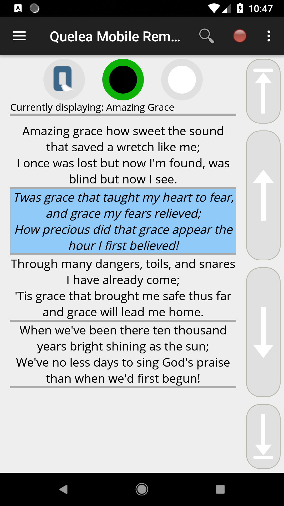
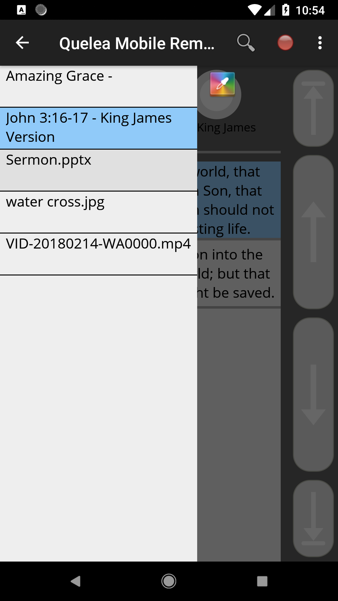
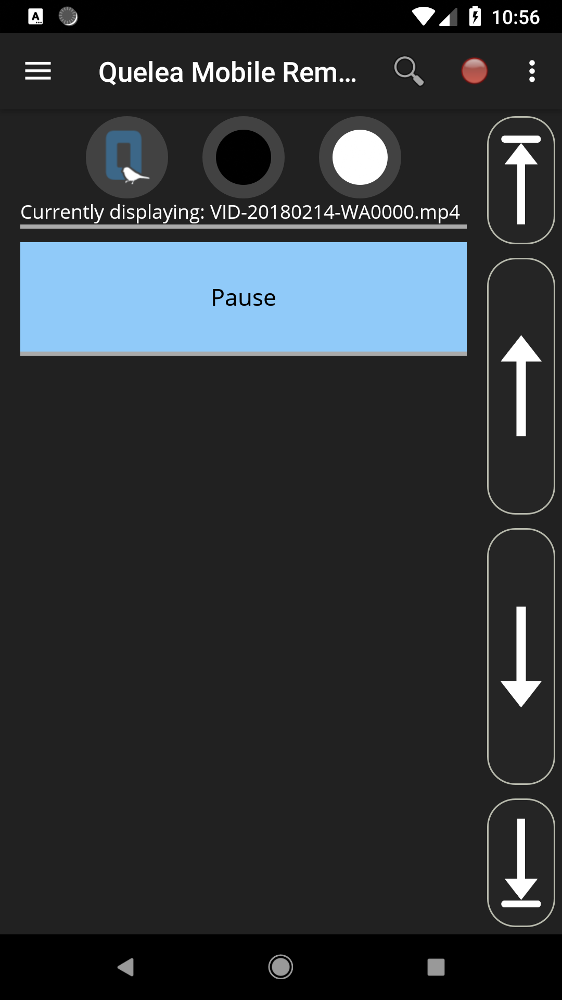

# Quelea Mobile Remote

&nbsp;&nbsp;&nbsp;  &nbsp;&nbsp;&nbsp; 

Quelea Mobile Remote is an Android app that allows you to remotely control the free church projection software Quelea. It is a customized version of the web site remote control feature for easier access.

### Download:
Download the app through the [Google Play Store](https://play.google.com/store/apps/details?id=org.quelea.mobileremote). You can clone or download the project here at Github. Feel free to help improve the code or to use it for your own projects.

### Features:
* See which item currently is live
* The lyrics of the current song with clickable slides
* Dedicated buttons for logo, black and clear to hide the text
* Dedicated buttons for next and previous slide/item
* View Quelea schedule and which item is live and which is in preview through sidebar menu
* Store sever URL
* Add a bible passage or a song to the schedule
* Start/stop recordings
* Navigation via volume buttons or directional pad (optional)
* Auto-connect feature (optional)
* [Change global themes](https://quelea.org/wiki/index.php/Themes#Set_a_global_theme)

### Prerequisites:
* [Quelea 2015.3 or later](https://sourceforge.net/projects/quelea/files/)
* [Active Mobile Remote server](http://quelea.org/wiki/index.php/Mobile_Remote#Activating_Mobile_Remote)
* Access to the same network as the server

### Known issues:
 None

### Troubleshooting
1. Make sure wifi is enable on your device and that you are connected to the same network as the computer with Quelea.
2. Check the URL in your web browser to make sure that the URL works as it is supposed to. If it does, then it's actually a issue with the app, otherwise it's a network-related issue.
3. Try changing port in Quelea. In case you have any other software using the same port, this will resolve the conflict.
4. Disable firewall and anti-virus temporarily to make sure that's not where the problem lies. If it is, you will have to add an exception in it for Quelea.
5. You might have to check your router settings to make sure port forwarding is enabled. This is different for every brand so please consult your product manual for this.

### Permissions:
* *Full network access* - Only used to connect to the Quelea server. The app can be used with no Internet connection as long as it has access to the same network as the server.
* *Prevent phone from sleeping* - Means that the screen is kept active as long as the app is running. It is possible to manually turn off the screen at any time.
* *View Wi-Fi connections* - Used in auto-connect feature to find server IP.

### Reporting bugs/Suggesting features
If you find any bugs or have any problems getting started, just add an issue to the project. In the same way you can also let me know if you have any suggestions or other feedback.
